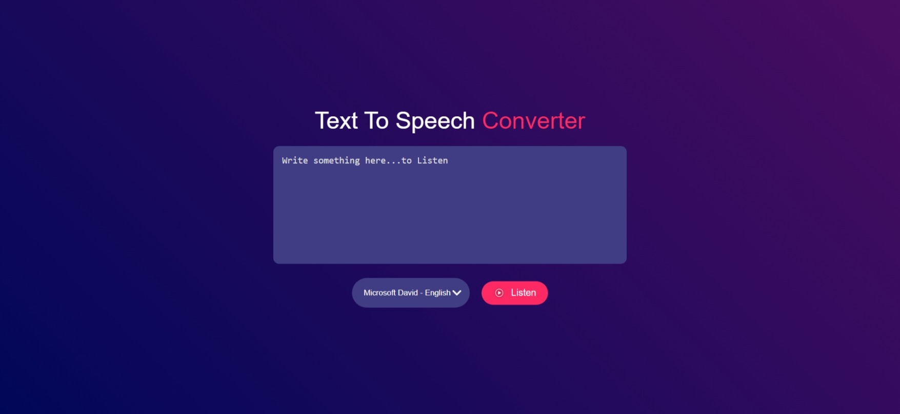
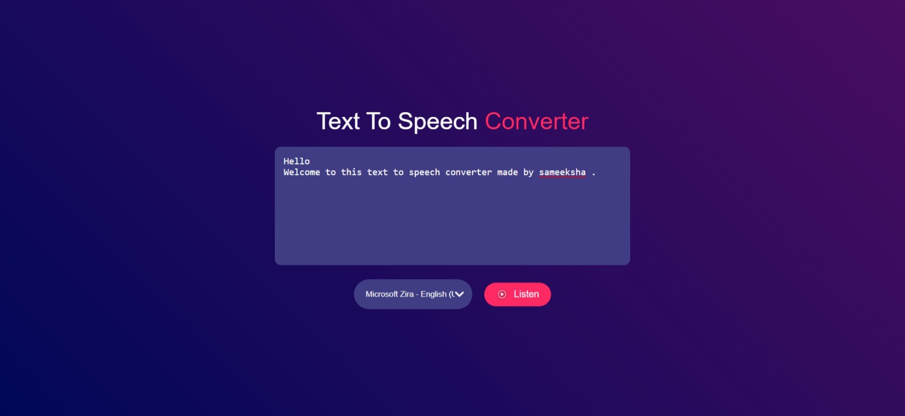

## Text to Voice Converter
This project allows users to convert text into speech where users can select different voices and listen to the spoken version of entered text.   

### Features : 
1. Text Input: Users can input any text into the provided textarea.  
2. Voice Selection: Choose from available voices to customize how the text is spoken.   
3. Playback Control: Click the "Listen" button to hear the text spoken aloud.    

### Getting Started :
#### To use the Text to Voice Converter:

1. Clone or download the repository.
2. Open index.html in your web browser.
3. Enter text into the textarea.
4. Select a voice from the dropdown list.
5. Click the "Listen" button to hear the spoken output of the entered text.
   
### Technologies Used :
1. HTML
2. CSS
3. JavaScript

### Demo :
#### Output Example: After entering text and selecting a voice, the output will be the spoken version of the entered text.

 

